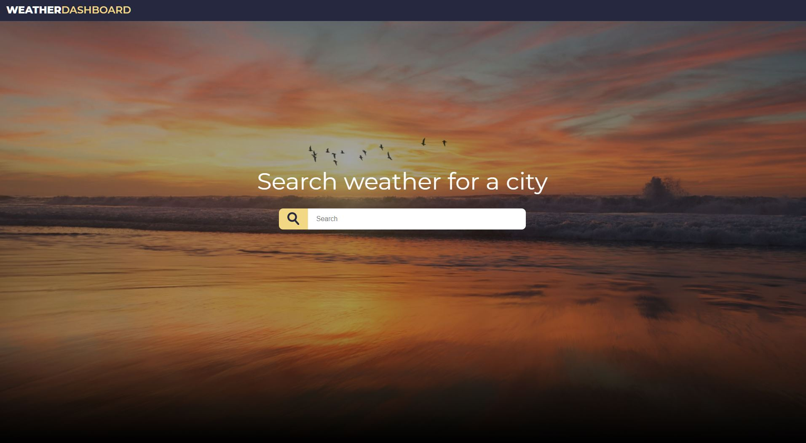
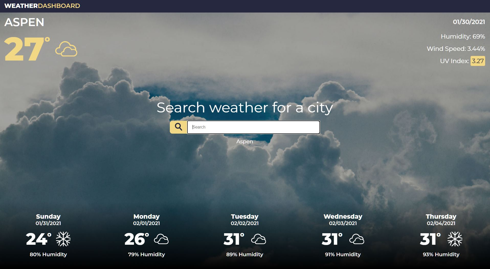
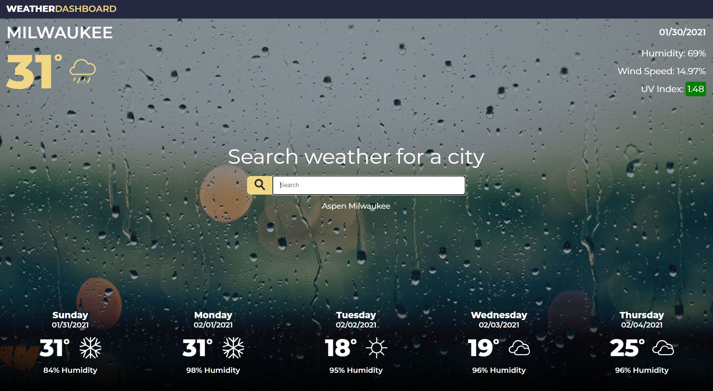

# Weather Dashboard

## Table of Contents
* [Description](#description)
* [The Challenge](#challenge)
* [The Criteria](#criteria)
* [Final Result](#results)
* [Reflection](#reflection)

## Description 
A weather dashboard using the OpenWeatherMap API to allow users to look up the current and 5-day forecast of US cities.

 
 
 

## The Challenge 
Create a weather dashboard to look up weather data for cities.

## The Criteria 
1. After searching a city, you presented with current and future conditions and then the city is added to search history.
1. The current weather displays the city name, date, weather conditions icon, temperature, humidity, wind speed, and UV index.
1. The UV index is colored to represent whether the conditions are favorable, moderate, or severe.
1. The 5-day forecast displays the date, weather conditions icon, temperature, and humidity.
1. Clicking on a city in the search history will display the current and future conditions for that city.

## Final Result 
The final generator can be viewed at [https://ianjacksondesign.com/weather-dashboard/](https://ianjacksondesign.com/weather-dashboard/)

## Reflection 
I managed to get through my online lessons early this week so I had some extra time to play around with this project. I started off doing some initial design mockups in Adobe Illustrator and once I settled on a design I started building out the HTML and CSS. 

I wanted to get the HTML and CSS built out first and get things placed on the site so I would have classes, id, and styles already in place for using in the JavaScript. I didn't have any major hangups except when it came to the loading the tasks that are stored in localStorage. I got it figured out though and once the site was completely working I used my extra time to try to make the site responsive. It currently mostly scales down to mobile devices, but still requires some work. I plan on revisiting after the bootcamp to revamp the page. 